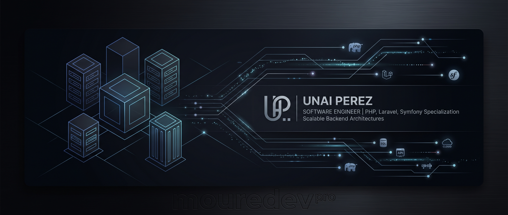

<!-- Replace the image path below with the URL or path where you upload your banner -->

  

  <h3>Software Engineer | Backend Developer (PHP, Laravel, Symfony) | Clean Architecture & APIs</h3>

---

### 👋 About me

I am a **Software Engineer** with **over 4 years of professional experience** building scalable web applications and RESTful APIs. After a strategic pause to complete my **Bachelor's Degree in Computer Engineering** (September 2026), I bring a strong foundation in software architecture, clean code (SOLID), and relational databases.

I excel at taking features end-to-end—from concept to production—while improving performance and maintainability.

---

### 💻 Tech Stack and Tools

**Backend & Architecture:**

**Databases & Infrastructure:**

**Testing & Frontend (Basics):**
-8A2BE2?style=for-the-badge)

---

### 🚀 Highlighted Project (Final Degree Project)

**B2B AI-Based Clinical Nutritional Support Platform**
*Enterprise clinical application that isolates medical logic and ensures algorithmic hallucination-free dietary plans through Artificial Intelligence.*

*   **Architecture:** Architected using **Hexagonal Architecture** and **Domain-Driven Design (DDD)** to ensure strict isolation of medical business logic.
*   **AI Engine:** Implemented a **Retrieval-Augmented Generation (RAG)** pipeline with the OpenAI API and vector database in **PostgreSQL (pgvector)**.
*   **Infrastructure:** Containerized the full-stack infrastructure using **Docker**, with a RESTful backend built in **Symfony 8.0** and user interface with **Next.js 16**.
*   **Quality:** High code coverage achieved via Test-Driven Development (**TDD**).

*(📌 I invite you to review the source code of this pinned repository on my profile)*

---

### 📫 Contact
*   **Email:** updev96@gmail.com
*   **LinkedIn:** https://www.linkedin.com/in/unai-perez/
